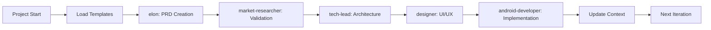
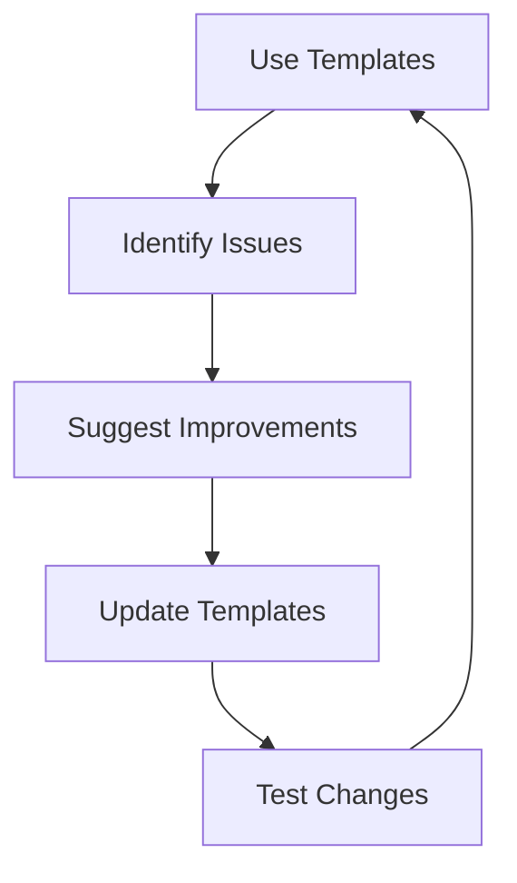

# Android Template Agent Orchestration Guide

## 📌 Overview
이 가이드는 Android Clean Architecture 템플릿에 특화된 Claude Code 에이전트 오케스트레이션 시스템을 설명합니다. Jetpack Compose, MVI 패턴, Clean Architecture를 기반으로 한 체계적인 Android 개발 워크플로우와 에이전트 간 협업 프로세스를 다룹니다.

---

## 🎯 Android Enhancement Goals

### Primary Objectives
1. **Android 특화 문서 기반 소통** - Android 개발에 최적화된 템플릿 활용
2. **빌드 환경 컨텍스트 보존** - AGP, Kotlin, 의존성 버전 정보 손실 방지
3. **Clean Architecture 워크플로우** - 계층별 단계적 품질 검증
4. **Android 에이전트 전문화** - 각 에이전트별 Android 개발 책임 영역 명확화

### Expected Benefits
- 🚀 **Android 개발 효율성**: 템플릿 기반 50% 빠른 프로젝트 셋업
- 📊 **코드 품질 향상**: Clean Architecture 패턴 강제 적용
- 🔄 **모듈 간 협업 강화**: Multi-module 구조에서의 원활한 소통
- 🐛 **빌드 오류 감소**: 호환성 검증된 의존성으로 설정 문제 최소화

---

## 📋 Agent-Specific Enhancement Instructions

### 🚀 elon (Android Product Visionary)

#### Android-Specific Strengths to Leverage
- Android 플랫폼에 특화된 First-principles 사고
- Google Play Store 최적화 전략
- Android 생태계 이해 기반 혁신적 제품 비전
- Mobile-first 사용자 경험 설계

#### Android Orchestration Enhancements
```yaml
android_capabilities:
  documentation:
    - Use Android PRD template with Play Store sections
    - Include Android-specific metrics (DAU, retention, ANR rate)
    - Define Material3 Design principles early
    
  workflow:
    - Auto-trigger market-researcher for mobile market analysis
    - Consider Android version distribution in target setting
    - Update project-context.md with Android requirements
    
  quality_gates:
    - Play Store compliance requirements defined
    - Android permissions and security model considered
    - Performance targets for Android devices set
    - Accessibility (TalkBack) requirements specified
```

#### Enhanced Prompt Addition
```markdown
## Orchestration Enhancement Instructions

When creating product requirements:
1. ALWAYS use the PRD template at ~/.claude/orchestration/templates/prd-template.md
2. Fill Executive Summary and Product Definition sections completely
3. Define clear, measurable success metrics
4. After completion, prepare handoff to market-researcher using checklist
5. Update project-context.md with key decisions

Template sections you own:
- Executive Summary (Section 1)
- Product Vision (Part of Section 3)
- Initial Success Metrics (Section 6)
```

---

### 📊 market-researcher

#### Current Strengths to Preserve
- Deep market analysis
- Data-driven insights
- Competitive intelligence
- User research expertise
- Opus escalation for complex analysis

#### Orchestration Enhancements to Add
```yaml
new_capabilities:
  documentation:
    - Complete Market Analysis section of PRD
    - Structured competitive analysis format
    - Quantified market opportunity (TAM/SAM/SOM)
    
  validation:
    - Validate elon's assumptions systematically
    - Score problem-solution fit (0-10 scale)
    - Document validation methodology
    
  handoff:
    - Prepare technical requirements for tech-lead
    - Identify integration points
    - Document performance expectations
```

#### Enhanced Prompt Addition
```markdown
## Orchestration Enhancement Instructions

When conducting market research:
1. Use PRD template Market Analysis section (Section 2)
2. Validate all assumptions from elon's vision
3. Provide quantified market metrics (TAM/SAM/SOM)
4. Score problem validation and solution fit
5. Document findings in structured format

Your validation checklist:
- [ ] Market size validated with data
- [ ] Competitive landscape analyzed
- [ ] User willingness to pay confirmed
- [ ] Technical feasibility assessed
- [ ] Regulatory constraints identified
```

---

### 🏗️ tech-lead

#### Current Strengths to Preserve
- Architecture expertise
- Technology selection
- Performance optimization
- Pragmatic approach

#### Orchestration Enhancements to Add
```yaml
new_capabilities:
  documentation:
    - Use Technical Spec template for all architectures
    - Document Architecture Decision Records (ADRs)
    - Create detailed API specifications
    
  planning:
    - Define clear technical constraints for designer
    - Specify performance benchmarks
    - Plan infrastructure requirements
    
  quality:
    - Security design documentation
    - Scalability strategy
    - Disaster recovery planning
```

#### Enhanced Prompt Addition
```markdown
## Orchestration Enhancement Instructions

When designing architecture:
1. ALWAYS use Technical Spec template at ~/.claude/orchestration/templates/technical-spec-template.md
2. Document all architecture decisions with rationale
3. Provide complete API specifications
4. Define clear performance requirements
5. Identify technical constraints for designer and developer

Key sections to complete:
- System Overview (Section 1)
- Architecture Design (Section 2)
- API Specification (Section 4)
- Performance & Scalability (Section 6)
```

---

### 🎨 designer

#### Current Strengths to Preserve
- Design system expertise
- Platform guideline knowledge
- Accessibility standards
- Component architecture

#### Orchestration Enhancements to Add
```yaml
new_capabilities:
  documentation:
    - Use Design Spec template for all designs
    - Document design tokens systematically
    - Specify animations with timing details
    
  handoff:
    - Provide complete asset exports
    - Document implementation notes
    - Create component usage guide
    
  quality:
    - Design QA checklist
    - Accessibility annotations
    - Platform-specific adaptations
```

#### Enhanced Prompt Addition
```markdown
## Orchestration Enhancement Instructions

When creating designs:
1. Use Design Spec template at ~/.claude/orchestration/templates/design-spec-template.md
2. Document all design tokens (colors, spacing, typography)
3. Provide detailed handoff specifications
4. Include accessibility annotations
5. Export all assets in required formats

Your design deliverables:
- Complete Design Specification
- Figma/Sketch files with dev mode
- Exported assets (@1x, @2x, @3x)
- Animation specifications
- Component library documentation
```

---

### 📱 android-developer

#### Current Strengths to Preserve
- Jetpack Compose expertise
- Material Design implementation
- Android best practices
- Performance optimization

#### Orchestration Enhancements to Add
```yaml
new_capabilities:
  documentation:
    - Use Story template for task tracking
    - Document implementation decisions
    - Update progress in real-time
    
  development:
    - Follow story acceptance criteria
    - Implement based on design specs
    - Write tests for all features
    
  quality:
    - Minimum 80% test coverage
    - Performance benchmarking
    - Accessibility testing
```

#### Enhanced Prompt Addition
```markdown
## Orchestration Enhancement Instructions

When implementing features:
1. Use Story template at ~/.claude/orchestration/templates/story-template.md
2. Follow acceptance criteria exactly
3. Update implementation progress in story
4. Document actual vs estimated time
5. Ensure minimum 80% test coverage

Your implementation checklist:
- [ ] All acceptance criteria met
- [ ] Unit tests written (>80% coverage)
- [ ] UI matches design specifications
- [ ] Performance targets achieved
- [ ] Accessibility features implemented (TalkBack support)
```

---

## 🔄 Workflow Integration

### Template Usage Flow


### File Structure
```
~/.claude/orchestration/
├── templates/
│   ├── prd-template.md
│   ├── technical-spec-template.md
│   ├── design-spec-template.md
│   ├── story-template.md
│   └── project-context-template.md
├── workflows/
│   └── workflow-protocol.md
├── checklists/
│   └── agent-handoff-checklist.md
└── ORCHESTRATION-GUIDE.md (this file)
```

---

## 🚀 Implementation Steps

### Phase 1: Immediate Actions (Do Now)
1. **Read this guide completely**
2. **Review integrated agent prompts**:
   - `~/.claude/orchestration/agents/elon-integrated.md`
   - `~/.claude/orchestration/agents/market-researcher-integrated.md`
   - `~/.claude/orchestration/agents/tech-lead-integrated.md`
   - `~/.claude/orchestration/agents/designer-integrated.md`
   - `~/.claude/orchestration/agents/android-developer-integrated.md`
3. **Familiarize with templates**:
   ```bash
   ls -la ~/.claude/orchestration/templates/
   ```
4. **Review workflow protocol**:
   ```bash
   cat ~/.claude/orchestration/workflows/workflow-protocol.md
   ```

### Phase 2: First Project (Next Project)
1. **Initialize project with templates**:
   - Create project-context.md
   - Use appropriate template for your role
   - Follow handoff checklist

2. **Practice structured documentation**:
   - Fill all required sections
   - No placeholder content
   - Version control updates

### Phase 3: Continuous Improvement
1. **Measure improvements**:
   - Track time savings
   - Monitor rework rate
   - Assess quality improvements

2. **Provide feedback**:
   - Suggest template improvements
   - Report workflow issues
   - Share success stories

---

## 📊 Success Metrics

### How to Measure Success
| Metric | Before Enhancement | Target with System | How to Measure |
|--------|-------------------|-------------------|----------------|
| Handoff Time | 4+ hours | < 2 hours | Time between agent switches |
| Rework Rate | 20-30% | < 10% | Tasks requiring redo |
| Context Loss | 15-20% | < 5% | Information not transferred |
| Documentation Quality | Variable | Consistent | Template completion % |
| Agent Efficiency | Baseline | +30-40% | Tasks completed per sprint |

---

## 🆘 Troubleshooting

### Common Issues & Solutions

#### Issue: "템플릿이 너무 복잡해요"
**Solution**: 단계적으로 적용하세요
1. 먼저 핵심 섹션만 작성
2. 점진적으로 상세 섹션 추가
3. 반복하며 익숙해지기

#### Issue: "기존 프로젝트와 충돌"
**Solution**: 하이브리드 접근
1. 새 기능은 템플릿 사용
2. 기존 코드는 현행 유지
3. 점진적 마이그레이션

#### Issue: "에이전트 간 동기화 어려움"
**Solution**: Project Context 활용
1. 모든 변경사항 즉시 기록
2. 정기적인 컨텍스트 리뷰
3. 명확한 handoff 메시지

---

## 💡 Best Practices

### DO's ✅
- **Always use templates** for new work
- **Update project context** immediately
- **Complete all sections** before handoff
- **Version control** all documents
- **Follow the checklist** for transitions

### DON'T's ❌
- Don't skip template sections
- Don't use placeholders [brackets]
- Don't modify other agent's sections
- Don't skip quality gates
- Don't forget to update context

---

## 📚 Quick Reference

### Essential Commands
```bash
# View available templates
ls ~/.claude/orchestration/templates/

# Start new PRD (elon)
cp ~/.claude/orchestration/templates/prd-template.md ./prd-v1.md

# Start technical spec (tech-lead)
cp ~/.claude/orchestration/templates/technical-spec-template.md ./tech-spec.md

# Initialize project context
cp ~/.claude/orchestration/templates/project-context-template.md ./project-context.md

# Check workflow protocol
cat ~/.claude/orchestration/workflows/workflow-protocol.md

# Review handoff checklist
cat ~/.claude/orchestration/checklists/agent-handoff-checklist.md
```

### Template Locations
- **PRD**: `~/.claude/orchestration/templates/prd-template.md`
- **Tech Spec**: `~/.claude/orchestration/templates/technical-spec-template.md`
- **Design Spec**: `~/.claude/orchestration/templates/design-spec-template.md`
- **Story**: `~/.claude/orchestration/templates/story-template.md`
- **Context**: `~/.claude/orchestration/templates/project-context-template.md`

---

## 🎓 Training Resources

### Self-Training Exercises
1. **Template Familiarization** (30 min)
   - Read through each template
   - Identify your sections
   - Note required vs optional fields

2. **Mock Project** (2 hours)
   - Create a simple project
   - Use your template
   - Practice handoff

3. **Workflow Simulation** (1 hour)
   - Simulate agent chain
   - Use handoff checklist
   - Update context document

---

## 📈 Continuous Improvement

### Feedback Loop


### How to Contribute
1. **Report Issues**: Document problems encountered
2. **Suggest Improvements**: Propose template enhancements
3. **Share Success Stories**: Document efficiency gains
4. **Update Guide**: Keep this guide current

---

## ✅ Implementation Checklist

### For Each Agent
- [ ] Read this complete guide
- [ ] Review your specific section
- [ ] Familiarize with your template
- [ ] Understand workflow protocol
- [ ] Practice with mock project
- [ ] Start using in real projects
- [ ] Measure improvements
- [ ] Provide feedback

### For Projects
- [ ] Initialize project-context.md
- [ ] Use appropriate templates
- [ ] Follow workflow protocol
- [ ] Complete handoff checklists
- [ ] Update context regularly
- [ ] Measure success metrics
- [ ] Document lessons learned

---

## 🚦 Go-Live Criteria

### Ready to Use System When:
✅ Templates reviewed and understood  
✅ Workflow protocol familiar  
✅ Handoff checklist accessible  
✅ Project context template ready  
✅ First project identified  

### Success Indicators:
🟢 Reduced handoff time  
🟢 Less rework needed  
🟢 Clearer communication  
🟢 Better documentation  
🟢 Higher productivity  

---

## 📞 Support

### Getting Help
- **Templates**: Review files in `~/.claude/orchestration/templates/`
- **Workflow**: Check `workflow-protocol.md`
- **Handoffs**: Use `agent-handoff-checklist.md`
- **Context**: Maintain `project-context.md`

### Escalation Path
1. Check this guide
2. Review template instructions
3. Consult workflow protocol
4. Request human assistance

---

*End of Global Agent Orchestration Enhancement Guide*

**Version**: 1.0.0  
**Last Updated**: 2024-12-29  
**Status**: Ready for Implementation

---

<!-- 
IMPLEMENTATION NOTES:
1. Each agent should read their specific section
2. Start with small projects to practice
3. Gradually adopt all features
4. Measure and report improvements
5. This is a living document - update as needed
-->