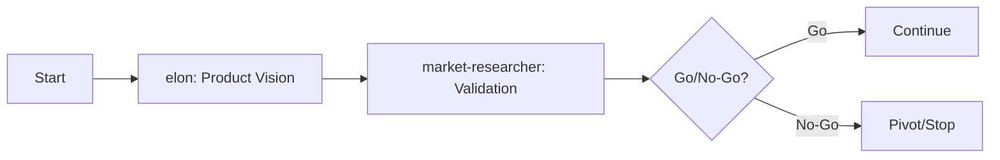
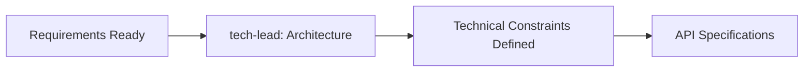
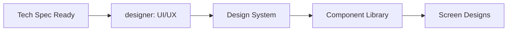
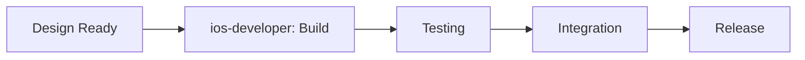

# Task: Execute Workflow

## Purpose
Guide the execution of the complete agent workflow chain from vision to implementation

## Workflow Sequence

### Phase 1: Discovery & Planning


### Phase 2: Technical Design


### Phase 3: Design


### Phase 4: Implementation


## Execution Steps

### Step 1: Check Prerequisites
```yaml
before_starting:
  verify:
    - project-context.md exists
    - templates are available
    - core-config.yaml is accessible
  
  if_missing:
    action: Run init-project task first
```

### Step 2: Product Vision (elon)
```yaml
activate: elon
task: Create PRD
template: prd-template.md
sections:
  - Executive Summary
  - Product Vision
  - Problem Statement
  - Initial Success Metrics

quality_gate:
  - Vision is clear and bold
  - Problem is well-defined
  - Success metrics are measurable

output: PRD draft in Docs/Product/
next: market-researcher
```

### Step 3: Market Validation (market-researcher)
```yaml
activate: market-researcher
task: Validate market opportunity
input: PRD from elon
sections:
  - Market Analysis
  - Competitive Landscape
  - User Research
  - Validation Scores

quality_gate:
  - Market size validated
  - Competition analyzed
  - User need confirmed
  - Go/No-Go decision clear

output: Updated PRD with market data
next: tech-lead (if Go)
```

### Step 4: Technical Architecture (tech-lead)
```yaml
activate: tech-lead
task: Design system architecture
input: Validated PRD
template: technical-spec-template.md
deliverables:
  - System architecture
  - Technology stack
  - API specifications
  - Performance requirements

quality_gate:
  - Architecture scalable
  - Tech stack justified
  - APIs defined
  - Constraints documented

output: Technical Specification
next: designer
```

### Step 5: UI/UX Design (designer)
```yaml
activate: designer
task: Create design system and screens
input: Tech spec + PRD
template: design-spec-template.md
deliverables:
  - Design tokens
  - Component library
  - Screen designs
  - Interaction patterns

quality_gate:
  - All screens designed
  - Design system complete
  - Assets exported
  - Accessibility verified

output: Design Specification + Assets
next: ios-developer
```

### Step 6: Implementation (ios-developer)
```yaml
activate: ios-developer
task: Build the application
input: Design + Tech spec
template: story-template.md
deliverables:
  - Source code
  - Unit tests
  - Integration tests
  - Documentation

quality_gate:
  - All features implemented
  - Tests passing (>80% coverage)
  - Performance targets met
  - Code review complete

output: Working application
next: Release preparation
```

## Monitoring & Tracking

### Progress Indicators
```markdown
## Workflow Progress
- [ ] Phase 1: Discovery & Planning
  - [ ] Product Vision ⏱️ 4h
  - [ ] Market Validation ⏱️ 6h
- [ ] Phase 2: Technical Design
  - [ ] Architecture ⏱️ 8h
- [ ] Phase 3: Design
  - [ ] UI/UX ⏱️ 10h
- [ ] Phase 4: Implementation
  - [ ] Development ⏱️ 40h
  - [ ] Testing ⏱️ 8h
```

### Status Updates
After each agent completes:
1. Update project-context.md
2. Check quality gates
3. Document decisions
4. Prepare handoff
5. Suggest next agent

## Error Recovery

### Common Issues
| Issue | Detection | Resolution |
|-------|-----------|------------|
| Agent timeout | No update in 24h | Manual intervention |
| Quality gate fail | Checklist incomplete | Rework required |
| Blocker found | Agent reports | Escalate/pivot |
| Scope creep | Requirements change | Re-validate with elon |

### Rollback Procedures
If phase fails:
1. Document failure reason
2. Identify rework needed
3. Return to previous agent
4. Update project context
5. Retry with fixes

## Communication Templates

### Handoff Message (Korean)
```
[Previous Agent]의 작업이 완료되었습니다.

✅ 완료 항목:
- [Item 1]
- [Item 2]

📋 품질 검증:
- [Check 1]: 통과
- [Check 2]: 통과

🔄 다음 단계:
[Next Agent]를 활성화하여 [Task]를 진행하시겠습니까?

예상 시간: [X]시간
```

### Progress Report (Korean)
```
📊 워크플로우 진행 상황

현재 단계: [Phase] ([X]/5)
진행률: [X]%
경과 시간: [X]시간
남은 시간: [X]시간

최근 완료:
- [Completed item]

현재 진행:
- [In progress item]

다음 예정:
- [Next item]
```

## Success Metrics

### Workflow KPIs
- Average phase completion time
- Quality gate pass rate (target: >95%)
- Rework frequency (target: <10%)
- Total workflow duration
- Agent handoff efficiency

### Continuous Improvement
After workflow completion:
1. Collect metrics
2. Identify bottlenecks
3. Document lessons learned
4. Update templates if needed
5. Optimize for next project

## Final Checklist
- [ ] All phases completed
- [ ] All quality gates passed
- [ ] Documentation complete
- [ ] Project context updated
- [ ] Ready for deployment