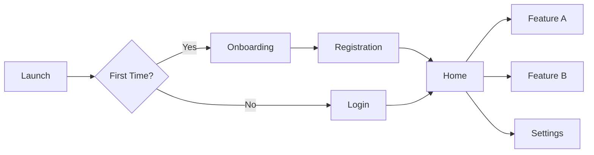

# Design Specification Document

## Document Metadata
- **Document Version**: 1.0.0
- **Created Date**: [YYYY-MM-DD]
- **Last Modified**: [YYYY-MM-DD]
- **Status**: [Draft | In Review | Approved | Archived]
- **Author**: [Agent: designer/ux-expert/human]
- **PRD Reference**: [Link to PRD document]
- **Figma/Sketch File**: [Link to design file]

---

## 1. Design Vision
<!-- designer 전용: 디자인 철학과 비전 -->

### Design Philosophy
[One paragraph describing the overall design approach and principles]

### Brand Attributes
- **Primary**: [e.g., Modern, Trustworthy, Innovative]
- **Secondary**: [e.g., Friendly, Professional, Minimal]
- **Personality**: [How the product should feel to users]

### Design Goals
1. [Primary design goal]
2. [Secondary design goal]
3. [Tertiary design goal]

---

## 2. Design System Foundation
<!-- 디자인 시스템 핵심 요소 정의 -->

### Color Palette
```swift
// Primary Colors
static let primary = Color(hex: "#007AFF")
static let primaryDark = Color(hex: "#0051D5")
static let primaryLight = Color(hex: "#54A3FF")

// Secondary Colors
static let secondary = Color(hex: "#5856D6")
static let accent = Color(hex: "#FF3B30")

// Neutral Colors
static let gray100 = Color(hex: "#F7F7F7")
static let gray200 = Color(hex: "#E5E5E7")
static let gray300 = Color(hex: "#C7C7CC")
static let gray400 = Color(hex: "#8E8E93")
static let gray500 = Color(hex: "#636366")
static let gray600 = Color(hex: "#48484A")
static let gray700 = Color(hex: "#363638")
static let gray800 = Color(hex: "#2C2C2E")
static let gray900 = Color(hex: "#1C1C1E")

// Semantic Colors
static let success = Color(hex: "#34C759")
static let warning = Color(hex: "#FF9500")
static let error = Color(hex: "#FF3B30")
static let info = Color(hex: "#007AFF")
```

### Typography System
```swift
// Font Scales
enum Typography {
    // Display
    static let largeTitle = Font.system(size: 34, weight: .bold)
    static let title1 = Font.system(size: 28, weight: .bold)
    static let title2 = Font.system(size: 22, weight: .bold)
    static let title3 = Font.system(size: 20, weight: .semibold)
    
    // Body
    static let headline = Font.system(size: 17, weight: .semibold)
    static let body = Font.system(size: 17, weight: .regular)
    static let callout = Font.system(size: 16, weight: .regular)
    static let subheadline = Font.system(size: 15, weight: .regular)
    static let footnote = Font.system(size: 13, weight: .regular)
    
    // Captions
    static let caption1 = Font.system(size: 12, weight: .regular)
    static let caption2 = Font.system(size: 11, weight: .regular)
}
```

### Spacing System
```swift
enum Spacing {
    static let xxxSmall: CGFloat = 2
    static let xxSmall: CGFloat = 4
    static let xSmall: CGFloat = 8
    static let small: CGFloat = 12
    static let medium: CGFloat = 16
    static let large: CGFloat = 24
    static let xLarge: CGFloat = 32
    static let xxLarge: CGFloat = 48
    static let xxxLarge: CGFloat = 64
}
```

### Border Radius
```swift
enum Radius {
    static let small: CGFloat = 4
    static let medium: CGFloat = 8
    static let large: CGFloat = 12
    static let xLarge: CGFloat = 16
    static let round: CGFloat = 9999
}
```

---

## 3. Component Library
<!-- 재사용 가능한 UI 컴포넌트 정의 -->

### Atoms (Basic Elements)
```yaml
buttons:
  primary_button:
    background: primary
    text: white
    height: 48
    radius: medium
    states:
      - default
      - pressed
      - disabled
      - loading
      
  secondary_button:
    background: transparent
    border: primary
    text: primary
    height: 48
    radius: medium

text_fields:
  default_input:
    height: 48
    border: gray300
    radius: medium
    padding: medium
    states:
      - default
      - focused
      - error
      - disabled

icons:
  size:
    small: 16
    medium: 24
    large: 32
  weight: regular | medium | bold
```

### Molecules (Combined Components)
```yaml
cards:
  default_card:
    background: white
    shadow: medium
    radius: large
    padding: medium
    
list_items:
  default_list_item:
    height: 60
    padding: medium
    separator: true
    accessories:
      - chevron
      - checkmark
      - detail_text
      
navigation:
  tab_bar:
    height: 49
    items: 2-5
    style: filled | outlined
    
  navigation_bar:
    height: 44
    style: large_title | standard
```

### Organisms (Complex Components)
```yaml
forms:
  login_form:
    components:
      - logo
      - email_field
      - password_field
      - forgot_password_link
      - login_button
      - signup_link
      
modals:
  alert:
    style: default | destructive
    buttons: 1-3
    
  action_sheet:
    options: 2+
    cancel_button: required
    
  bottom_sheet:
    height: dynamic | half | full
    handle: visible
```

---

## 4. Layout & Grid System
<!-- 레이아웃 원칙과 그리드 시스템 -->

### Grid System
```yaml
mobile:
  columns: 4
  gutter: 16
  margin: 16
  
tablet:
  columns: 8
  gutter: 24
  margin: 24
  
desktop:
  columns: 12
  gutter: 24
  margin: 24
```

### Safe Areas & Margins
```swift
struct LayoutGuides {
    static let safeAreaTop: CGFloat = 44 // Status bar
    static let safeAreaBottom: CGFloat = 34 // Home indicator
    static let standardMargin: CGFloat = 16
    static let compactMargin: CGFloat = 12
    static let edgeMargin: CGFloat = 20
}
```

### Responsive Breakpoints
| Device | Size Class | Width Range | Columns |
|--------|------------|-------------|---------|
| iPhone SE | Compact | 320-374 | 4 |
| iPhone | Regular | 375-413 | 4 |
| iPhone Plus | Regular | 414-428 | 4 |
| iPad Portrait | Regular | 768-833 | 8 |
| iPad Landscape | Regular | 1024-1366 | 12 |

---

## 5. User Flows & Wireframes
<!-- 주요 사용자 플로우와 와이어프레임 -->

### Core User Flows


### Screen Inventory
| Screen Name | Purpose | Priority | Status |
|-------------|---------|----------|--------|
| Splash | App launch | P0 | Complete |
| Onboarding | First-time experience | P0 | In Progress |
| Login | Authentication | P0 | Complete |
| Home | Main navigation | P0 | In Progress |
| Profile | User information | P1 | Not Started |
| Settings | App configuration | P1 | Not Started |

### Wireframe Links
- [Onboarding Flow]: [Figma link]
- [Main Navigation]: [Figma link]
- [Feature Flows]: [Figma link]

---

## 6. Interaction Design
<!-- 인터랙션과 애니메이션 정의 -->

### Gestures & Interactions
| Gesture | Action | Feedback |
|---------|--------|----------|
| Tap | Primary action | Highlight + haptic |
| Long press | Secondary menu | Haptic + menu |
| Swipe left | Delete/Archive | Red background |
| Swipe right | Mark/Flag | Color change |
| Pull to refresh | Reload content | Loading indicator |
| Pinch | Zoom | Smooth scale |

### Animation Specifications
```swift
enum Animation {
    // Durations
    static let fast: Double = 0.2
    static let medium: Double = 0.3
    static let slow: Double = 0.5
    
    // Curves
    static let easeIn = Animation.easeIn(duration: medium)
    static let easeOut = Animation.easeOut(duration: medium)
    static let spring = Animation.spring(response: 0.5, dampingFraction: 0.8)
    
    // Transitions
    static let fadeIn = AnyTransition.opacity
    static let slideIn = AnyTransition.slide
    static let scaleIn = AnyTransition.scale
}
```

### Micro-interactions
- **Button Press**: Scale down to 0.95 with spring animation
- **Tab Switch**: Fade transition with 0.2s duration
- **Modal Present**: Slide up with spring damping
- **Loading State**: Pulse animation at 1.5s intervals
- **Success State**: Check mark with scale + fade animation

---

## 7. Accessibility & Inclusivity
<!-- 접근성 가이드라인 -->

### Accessibility Requirements
- **WCAG Level**: AA compliance minimum
- **VoiceOver**: Full support with meaningful labels
- **Dynamic Type**: Support for all text sizes
- **Color Contrast**: Minimum 4.5:1 for normal text, 3:1 for large text
- **Touch Targets**: Minimum 44x44 points

### Accessibility Annotations
```swift
// Example accessibility implementation
Button(action: startRunning) {
    Image(systemName: "play.fill")
}
.accessibilityLabel("Start running")
.accessibilityHint("Double tap to begin your running session")
.accessibilityAddTraits(.startsMediaSession)
```

### Inclusive Design Considerations
- **Color Blindness**: Don't rely solely on color
- **Motion Sensitivity**: Provide reduced motion options
- **Screen Readers**: Logical reading order
- **Keyboard Navigation**: Full keyboard support
- **Localization**: RTL language support

---

## 8. Platform-Specific Guidelines
<!-- iOS Human Interface Guidelines 준수 -->

### iOS Design Patterns
- **Navigation**: UINavigationController pattern
- **Modality**: Sheet, fullscreen, popover
- **Controls**: Native iOS controls when possible
- **Feedback**: Haptic feedback for important actions
- **App Icon**: Follow Apple's icon grid

### iOS-Specific Components
```yaml
ios_components:
  - UITabBar
  - UINavigationBar
  - UISearchBar
  - UITableView/List
  - UICollectionView/LazyGrid
  - UIPageControl
  - UISegmentedControl
  - UISwitch/Toggle
  - UISlider
  - UIDatePicker
```

### Platform Adaptations
| Feature | iPhone | iPad | Mac Catalyst |
|---------|--------|------|--------------|
| Navigation | Tab bar | Sidebar | Sidebar |
| Layout | Single column | Multi-column | Multi-window |
| Modals | Full screen | Popover | Window |
| Keyboard | On-screen | External support | Native |

---

## 9. Dark Mode & Theming
<!-- 다크모드와 테마 시스템 -->

### Color Semantic Mapping
```swift
enum Colors {
    // Adaptive colors
    @Environment(\.colorScheme) var colorScheme
    
    static let background = Color("Background") // White/Black
    static let foreground = Color("Foreground") // Black/White
    static let secondaryBackground = Color("SecondaryBackground")
    static let tertiaryBackground = Color("TertiaryBackground")
    
    // Fixed colors (same in both modes)
    static let brand = Color("BrandColor")
    static let accent = Color("AccentColor")
}
```

### Dark Mode Adjustments
| Element | Light Mode | Dark Mode |
|---------|------------|-----------|
| Background | #FFFFFF | #000000 |
| Surface | #F2F2F7 | #1C1C1E |
| Text Primary | #000000 | #FFFFFF |
| Text Secondary | #3C3C43 | #EBEBF5 |
| Separator | #C6C6C8 | #38383A |

---

## 10. Design QA Checklist
<!-- 디자인 품질 검증 체크리스트 -->

### Visual Design
- [ ] Colors match design system
- [ ] Typography follows hierarchy
- [ ] Spacing is consistent
- [ ] Icons are pixel-perfect
- [ ] Images are optimized

### Interaction Design
- [ ] Touch targets ≥ 44x44pt
- [ ] Animations are smooth (60fps)
- [ ] Feedback is immediate
- [ ] Gestures are intuitive
- [ ] Loading states are clear

### Responsiveness
- [ ] Works on all screen sizes
- [ ] Handles orientation changes
- [ ] Text truncation is handled
- [ ] Images scale properly
- [ ] Layout doesn't break

### Accessibility
- [ ] VoiceOver tested
- [ ] Dynamic type tested
- [ ] Color contrast verified
- [ ] Focus order is logical
- [ ] Labels are meaningful

---

## 11. Handoff to Development
<!-- 개발자에게 전달할 정보 -->

### Design Assets
- [ ] All screens exported at @1x, @2x, @3x
- [ ] Icons in PDF or SVG format
- [ ] Lottie files for animations
- [ ] Color values in hex/RGB
- [ ] Font files if custom

### Development Notes
```yaml
special_considerations:
  - Complex animation on screen X needs 60fps
  - Custom transition between screens Y and Z
  - Parallax scrolling effect on home screen
  - Glassmorphism effect requires iOS 15+
  
performance_notes:
  - Lazy load images in list views
  - Implement skeleton screens for loading
  - Use blur effects sparingly
```

### Redlines & Specifications
| Screen | Figma Link | Notes |
|--------|------------|-------|
| Home | [Link] | Tab bar customization needed |
| Profile | [Link] | Complex gradient background |
| Settings | [Link] | Standard iOS patterns |

---

## 12. Agent Handoff Notes
<!-- 다음 에이전트를 위한 전달사항 -->

### For ios-developer
- [ ] Design tokens implemented in code
- [ ] Component library documented
- [ ] Animations specified with timing
- [ ] Edge cases designed
- [ ] Responsive behavior defined

### For tech-lead
- [ ] Performance implications noted
- [ ] Third-party library needs identified
- [ ] Platform limitations considered
- [ ] Accessibility requirements clear

### For QA
- [ ] Design regression test cases
- [ ] Visual acceptance criteria
- [ ] Animation performance metrics
- [ ] Device-specific considerations

---

<!-- 
USAGE INSTRUCTIONS:
1. designer agent: Complete all design sections
2. Focus on iOS-specific patterns and guidelines
3. Provide clear specifications for developers
4. Include all necessary assets and documentation
5. Ensure accessibility is considered throughout
-->