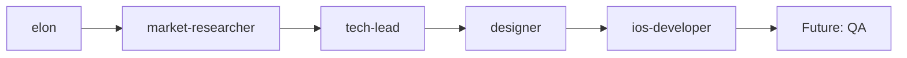

# Project Context Document

## Document Metadata
- **Project Name**: [Project Name]
- **Project Code**: [PROJ-XXX]
- **Created Date**: [YYYY-MM-DD]
- **Last Updated**: [YYYY-MM-DD]
- **Current Phase**: [Discovery | Planning | Development | Testing | Launch | Maintenance]
- **Overall Status**: 🟢 On Track | 🟡 At Risk | 🔴 Blocked

---

## 1. Project Overview
<!-- 프로젝트 전체 개요 및 현재 상태 -->

### Project Summary
[One paragraph describing what this project is about and its current state]

### Key Objectives
1. [Primary objective]
2. [Secondary objective]
3. [Tertiary objective]

### Success Criteria
- [ ] [Measurable success criterion 1]
- [ ] [Measurable success criterion 2]
- [ ] [Measurable success criterion 3]

### Project Timeline
```
Discovery    Planning    Development    Testing    Launch
   |------------|-------------|-----------|---------|
   Week 1-2     Week 3-4      Week 5-8    Week 9   Week 10
                              ↑
                         Current Phase
```

---

## 2. Active Agents & Responsibilities
<!-- 현재 프로젝트에 참여 중인 에이전트와 역할 -->

### Agent Roster
| Agent | Role | Current Task | Status | Last Active |
|-------|------|--------------|--------|-------------|
| elon | Product Vision | PRD Creation | ✅ Complete | [Date] |
| market-researcher | Market Analysis | Validation | 🔄 In Progress | [Date] |
| tech-lead | Architecture | Tech Spec | 📋 Pending | [Date] |
| designer | UI/UX Design | Wireframes | 🔄 In Progress | [Date] |
| ios-developer | Implementation | - | ⏸️ Waiting | [Date] |

### Agent Dependencies


---

## 3. Current Sprint/Phase
<!-- 현재 진행 중인 스프린트 또는 단계 정보 -->

### Sprint Information
- **Sprint Number**: [Sprint X]
- **Sprint Goal**: [Clear sprint goal]
- **Start Date**: [YYYY-MM-DD]
- **End Date**: [YYYY-MM-DD]
- **Working Days Remaining**: [X days]

### Sprint Backlog
| Story ID | Title | Assigned To | Status | Story Points |
|----------|-------|-------------|--------|--------------|
| PROJ-001 | [Title] | [Agent] | 🔄 In Progress | 3 |
| PROJ-002 | [Title] | [Agent] | 📋 To Do | 5 |
| PROJ-003 | [Title] | [Agent] | ✅ Done | 2 |

### Burndown Status
```
Story Points Remaining:
Day 1: ████████████████████ 20
Day 2: ██████████████████   18
Day 3: ████████████████     16  ← Today
Day 4: [Projected]
Day 5: [Projected]
```

---

## 4. Key Decisions & Changes
<!-- 중요한 결정사항과 변경 내역 -->

### Recent Decisions
| Date | Decision | Made By | Impact | Rationale |
|------|----------|---------|--------|-----------|
| [Date] | [What was decided] | [Agent] | [High/Med/Low] | [Why] |
| [Date] | [What was decided] | [Agent] | [High/Med/Low] | [Why] |

### Change Log
| Date | Change Type | Description | Approved By |
|------|-------------|-------------|-------------|
| [Date] | Scope | [What changed] | [Who] |
| [Date] | Timeline | [What changed] | [Who] |
| [Date] | Technical | [What changed] | [Who] |

---

## 5. Completed Artifacts
<!-- 완성된 문서와 산출물 -->

### Documentation
| Document | Version | Location | Status | Last Updated |
|----------|---------|----------|--------|--------------|
| PRD | v1.2 | [Link] | ✅ Approved | [Date] |
| Market Analysis | v1.0 | [Link] | ✅ Complete | [Date] |
| Technical Spec | v0.9 | [Link] | 🔄 Draft | [Date] |
| Design Mockups | v0.5 | [Link] | 🔄 In Progress | [Date] |

### Code & Components
| Component | Location | Status | Test Coverage |
|-----------|----------|--------|---------------|
| [Component] | [Path] | ✅ Complete | 85% |
| [Component] | [Path] | 🔄 In Progress | 60% |

---

## 6. Pending Items & Blockers
<!-- 대기 중인 항목과 블로커 -->

### Waiting For
| Item | Waiting On | Required By | Impact if Delayed |
|------|------------|-------------|-------------------|
| API Endpoints | Backend Team | [Date] | Development blocked |
| Design Assets | Designer | [Date] | UI implementation delayed |
| App Store Account | Client | [Date] | Launch delayed |

### Current Blockers
| Blocker | Description | Owner | Priority | ETA for Resolution |
|---------|-------------|-------|----------|-------------------|
| [Title] | [Description] | [Who] | 🔴 Critical | [Date] |
| [Title] | [Description] | [Who] | 🟡 High | [Date] |

### Risk Register
| Risk | Probability | Impact | Mitigation | Status |
|------|-------------|--------|------------|--------|
| [Risk] | High/Med/Low | High/Med/Low | [Plan] | 🟡 Monitoring |

---

## 7. Communication Log
<!-- 중요한 커뮤니케이션 기록 -->

### Recent Updates
| Date | From | To | Subject | Action Required |
|------|------|----|---------| --------------- |
| [Date] | elon | tech-lead | Architecture review needed | Review by [Date] |
| [Date] | designer | ios-developer | Design system ready | Begin implementation |

### Scheduled Sync Points
| Date | Participants | Purpose | Outcome |
|------|--------------|---------|---------|
| [Date] | All agents | Sprint Planning | [Pending] |
| [Date] | Tech agents | Architecture Review | [Pending] |

---

## 8. Next Actions
<!-- 다음 단계 작업 계획 -->

### Immediate Next Steps (Next 24-48 hours)
1. **[Agent Name]**: [Specific action]
2. **[Agent Name]**: [Specific action]
3. **[Agent Name]**: [Specific action]

### Upcoming Milestones
| Milestone | Target Date | Dependencies | Status |
|-----------|-------------|--------------|--------|
| Design Complete | [Date] | PRD approval | 🔄 On Track |
| Dev Complete | [Date] | Design + API | 🟡 At Risk |
| Beta Launch | [Date] | Dev + Testing | 📋 Not Started |

### Agent Activation Queue
```
Current: designer
Next: ios-developer (waiting for design completion)
Then: QA testing (after development)
```

---

## 9. Resource Tracking
<!-- 리소스 사용 현황 -->

### Time Tracking
| Agent | Estimated Hours | Actual Hours | Remaining | Utilization |
|-------|----------------|--------------|-----------|-------------|
| elon | 20 | 18 | 2 | 90% |
| market-researcher | 15 | 12 | 3 | 80% |
| tech-lead | 25 | 5 | 20 | 20% |
| designer | 30 | 15 | 15 | 50% |
| ios-developer | 40 | 0 | 40 | 0% |

### Token/Resource Usage
```
API Calls Used: 1,234 / 10,000 (12.34%)
Storage Used: 456 MB / 5 GB (9.12%)
Compute Hours: 78 / 500 (15.6%)
```

---

## 10. Quality Metrics
<!-- 품질 지표 및 성과 측정 -->

### Code Quality
- **Test Coverage**: 75% (Target: 80%)
- **Code Review Coverage**: 100%
- **Linting Errors**: 0
- **Security Vulnerabilities**: 0

### Process Metrics
- **Velocity**: 15 story points/sprint
- **Cycle Time**: 3 days average
- **Defect Rate**: 2 per sprint
- **On-Time Delivery**: 85%

---

## 11. Learning & Improvements
<!-- 학습 내용과 개선 사항 -->

### Lessons Learned
1. [What worked well]
2. [What didn't work]
3. [What to improve]

### Process Improvements
- [ ] [Improvement action 1]
- [ ] [Improvement action 2]
- [ ] [Improvement action 3]

### Knowledge Base Updates
| Topic | Document | Status |
|-------|----------|--------|
| [Topic] | [Link] | ✅ Updated |
| [Topic] | [Link] | 📋 Pending |

---

## 12. Quick References
<!-- 빠른 참조를 위한 링크 모음 -->

### Important Links
- **Project Repository**: [GitHub/GitLab link]
- **Project Board**: [Jira/Trello/Linear link]
- **Design Files**: [Figma/Sketch link]
- **API Documentation**: [Swagger/Postman link]
- **Staging Environment**: [URL]
- **Production Environment**: [URL]

### Key Contacts
| Role | Agent/Person | Contact Method |
|------|--------------|----------------|
| Product Owner | elon | @elon agent |
| Tech Lead | tech-lead | @tech-lead agent |
| Design Lead | designer | @designer agent |

### Command Quick Reference
```bash
# Check project status
claude project status

# Activate specific agent
claude agent activate [agent-name]

# Generate progress report
claude report generate --type=progress

# Run test suite
claude test run --all
```

---

## Context Preservation Guidelines
<!-- 컨텍스트 보존을 위한 가이드라인 -->

### When to Update This Document
- ✅ After each agent completes their task
- ✅ When blockers are identified or resolved
- ✅ At the end of each day/sprint
- ✅ When key decisions are made
- ✅ When scope or timeline changes

### What to Preserve
- Critical decisions and their rationale
- Dependencies between agents
- Completed work and its location
- Outstanding issues and blockers
- Communication that affects project direction

### How Agents Should Use This
1. **Before Starting**: Read entire document
2. **During Work**: Update status in real-time
3. **After Completing**: Document outcomes and handoffs
4. **When Blocked**: Log blocker with details
5. **When Switching**: Ensure clean handoff notes

---

<!-- 
USAGE INSTRUCTIONS:
1. This document is the single source of truth for project state
2. All agents must update this when their status changes
3. Use clear, concise language for quick scanning
4. Keep historical information for reference
5. Prune outdated information monthly
6. This document enables seamless agent handoffs
-->