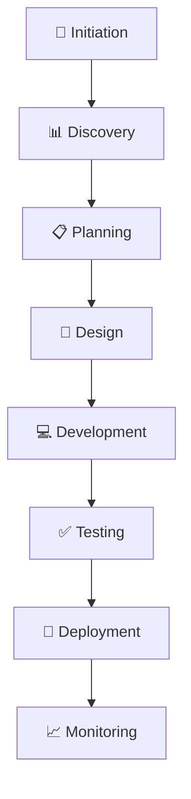
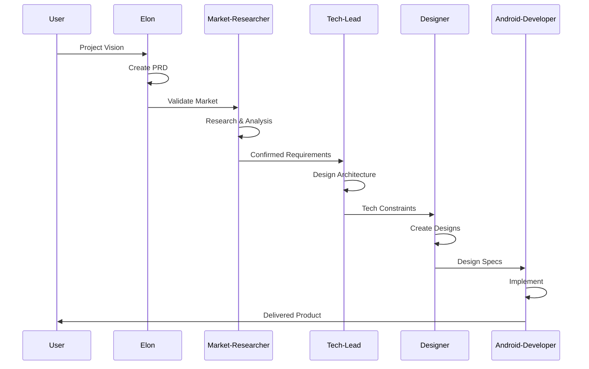

# BMAD-Enhanced Workflow Protocol

## Document Metadata
- **Version**: 1.0.0
- **Created Date**: 2024-12-29
- **Purpose**: Define structured workflow for global agents with BMAD methodology
- **Applies To**: All Claude Code global agents

---

## 1. Workflow Overview
<!-- 전체 워크플로우 구조와 철학 -->

### Core Principles
1. **Sequential Execution**: 각 단계는 이전 단계의 산출물을 기반으로 진행
2. **Document-Driven**: 모든 소통은 구조화된 문서를 통해 이루어짐
3. **Context Preservation**: 프로젝트 컨텍스트가 손실되지 않도록 관리
4. **Quality Gates**: 각 단계 완료 시 품질 검증 수행
5. **Traceability**: 모든 결정과 변경사항 추적 가능

### Workflow Phases


---

## 2. Agent Execution Chain
<!-- 에이전트 실행 순서와 역할 -->

### Standard Execution Order
```yaml
phase_1_discovery:
  agents:
    - elon: "Vision & Requirements"
    - market-researcher: "Market Validation"
  outputs:
    - PRD Document
    - Market Analysis Report

phase_2_planning:
  agents:
    - tech-lead: "Architecture Design"
  outputs:
    - Technical Specification
    - Architecture Decisions

phase_3_design:
  agents:
    - designer: "UI/UX Design"
  outputs:
    - Design Specification
    - Component Library

phase_4_development:
  agents:
    - android-developer: "Implementation"
  outputs:
    - Source Code
    - Unit Tests
```

### Parallel Execution Rules
```yaml
can_run_parallel:
  - [market-researcher, designer]  # If PRD is complete
  - [multiple android-developers]   # For different features

must_run_sequential:
  - elon → market-researcher       # Validation needs vision
  - tech-lead → android-developer  # Implementation needs architecture
  - designer → android-developer   # UI implementation needs design
```

---

## 3. Document Flow Protocol
<!-- 문서 기반 소통 프로토콜 -->

### Document Handoff Process
```yaml
handoff_structure:
  from_agent: "elon"
  to_agent: "market-researcher"
  documents:
    required:
      - name: "PRD"
        sections: ["Executive Summary", "Product Definition"]
        status: "Approved"
    optional:
      - name: "User Research"
        status: "Draft"
  
  handoff_checklist:
    - Document completeness verified
    - All required sections filled
    - No placeholder content ([brackets])
    - Review comments addressed
    - Version control updated
```

### Document Access Control
| Document | Create | Read | Update | Delete |
|----------|--------|------|--------|--------|
| PRD | elon | All | elon, market-researcher | None |
| Tech Spec | tech-lead | All | tech-lead | None |
| Design Spec | designer | All | designer | None |
| Story | All | All | Assigned agent | None |
| Project Context | All | All | All | None |

---

## 4. Communication Protocol
<!-- 에이전트 간 소통 규칙 -->

### Message Format
```markdown
## Agent Communication

**From**: [Source Agent]
**To**: [Target Agent]
**Subject**: [Clear subject line]
**Priority**: [Critical | High | Normal | Low]
**Action Required**: [Yes/No]

### Context
[Brief context about the message]

### Message
[Main content]

### Required Actions
1. [Specific action 1]
2. [Specific action 2]

### Attachments
- [Document/Link 1]
- [Document/Link 2]

### Response Deadline
[YYYY-MM-DD HH:MM]
```

### Escalation Protocol
```yaml
escalation_triggers:
  - blocker_unresolved_24h
  - critical_decision_needed
  - scope_change_request
  - timeline_risk_identified

escalation_path:
  level_1: "Peer agent consultation"
  level_2: "Tech-lead involvement"
  level_3: "Human intervention required"
```

---

## 5. Quality Gates
<!-- 품질 검증 체크포인트 -->

### Phase Transition Checklist

#### Discovery → Planning
- [ ] PRD approved and finalized
- [ ] Market validation complete
- [ ] Success metrics defined
- [ ] Budget approved
- [ ] Timeline established

#### Planning → Design
- [ ] Technical architecture approved
- [ ] API specifications defined
- [ ] Security review complete
- [ ] Performance targets set
- [ ] Infrastructure planned

#### Design → Development
- [ ] Design system established
- [ ] All screens designed
- [ ] Interaction patterns defined
- [ ] Assets exported
- [ ] Design QA complete

#### Development → Testing
- [ ] All features implemented
- [ ] Unit tests passing (>80% coverage)
- [ ] Code review complete
- [ ] Documentation updated
- [ ] No critical bugs

#### Testing → Deployment
- [ ] All test cases passed
- [ ] Performance benchmarks met
- [ ] Security scan passed
- [ ] Rollback plan ready
- [ ] Monitoring configured

---

## 6. Context Management Rules
<!-- 컨텍스트 보존 및 관리 규칙 -->

### Context Update Triggers
```yaml
must_update_context:
  - agent_task_completion
  - blocker_identified
  - decision_made
  - scope_change
  - timeline_change
  - new_dependency
  - risk_identified
```

### Context Structure
```markdown
## Current Context Snapshot

### Active Phase
[Current phase and progress]

### Recent Changes
- [Change 1 with timestamp]
- [Change 2 with timestamp]

### Active Blockers
- [Blocker 1 with owner]
- [Blocker 2 with owner]

### Next Actions
- [Agent 1]: [Action]
- [Agent 2]: [Action]

### Decision Log
| Decision | Made By | Date | Impact |
|----------|---------|------|--------|
| [What] | [Who] | [When] | [Impact] |
```

---

## 7. Template Usage Guidelines
<!-- 템플릿 사용 가이드라인 -->

### When to Use Templates
| Scenario | Template | Mandatory |
|----------|----------|-----------|
| New project start | PRD | Yes |
| Feature planning | PRD | Yes |
| Technical design | Tech Spec | Yes |
| UI/UX work | Design Spec | Yes |
| Development task | Story | Yes |
| Project tracking | Context | Yes |

### Template Filling Rules
1. **No Placeholders**: [brackets] 내용은 실제 내용으로 교체
2. **Complete Sections**: 빈 섹션 없이 모두 작성
3. **Version Control**: 모든 변경사항에 버전 업데이트
4. **Review Required**: 주요 섹션 완료 시 리뷰 필수

---

## 8. Error Handling Protocol
<!-- 오류 처리 프로토콜 -->

### Common Issues & Solutions
| Issue | Detection | Resolution | Prevention |
|-------|-----------|------------|------------|
| Context Loss | Missing information | Restore from backup | Regular updates |
| Document Conflict | Version mismatch | Merge carefully | Lock mechanism |
| Agent Timeout | No response 24h | Reassign task | Status monitoring |
| Quality Failure | Gate check fail | Rework required | Better planning |

### Recovery Procedures
```yaml
context_recovery:
  1. Check project-context.md
  2. Review recent commits
  3. Consult previous agent logs
  4. Reconstruct from documents

document_recovery:
  1. Check version history
  2. Restore from backup
  3. Merge conflicts manually
  4. Validate with stakeholders
```

---

## 9. Performance Metrics
<!-- 워크플로우 성능 지표 -->

### Workflow KPIs
| Metric | Target | Measurement |
|--------|--------|-------------|
| Phase Transition Time | < 4 hours | Time between phases |
| Document Completeness | 100% | Filled sections ratio |
| Handoff Success Rate | > 95% | Successful transitions |
| Context Preservation | > 98% | Information retained |
| Rework Rate | < 10% | Tasks requiring redo |

### Agent Performance
| Agent | Avg Task Time | Success Rate | Quality Score |
|-------|---------------|--------------|---------------|
| elon | 4 hours | 95% | 9.2/10 |
| market-researcher | 6 hours | 92% | 8.8/10 |
| tech-lead | 8 hours | 94% | 9.0/10 |
| designer | 10 hours | 90% | 8.5/10 |
| android-developer | 12 hours | 88% | 8.7/10 |

---

## 10. Continuous Improvement
<!-- 지속적 개선 프로세스 -->

### Feedback Loop
```yaml
feedback_collection:
  - post_phase_review
  - agent_retrospective
  - quality_gate_analysis
  - performance_review

improvement_areas:
  - template_optimization
  - handoff_efficiency
  - context_management
  - quality_standards
```

### Process Evolution
1. **Monthly Review**: 워크플로우 효율성 검토
2. **Quarterly Update**: 템플릿 및 프로세스 개선
3. **Annual Overhaul**: 전체 시스템 재평가

---

## 11. Tool Integration
<!-- 도구 통합 가이드 -->

### Required Tools
```yaml
documentation:
  - templates: "BMAD templates"
  - version_control: "Git"
  - collaboration: "Project Context"

development:
  - ide: "Android Studio/VS Code"
  - testing: "JUnit/Espresso"
  - ci_cd: "GitHub Actions"

communication:
  - async: "Document updates"
  - sync: "Agent commands"
  - notifications: "Status changes"
```

### Automation Opportunities
- [ ] Template generation
- [ ] Status tracking
- [ ] Quality gate checks
- [ ] Document validation
- [ ] Context updates

---

## 12. Quick Reference
<!-- 빠른 참조 가이드 -->

### Agent Activation Commands
```bash
# Activate specific agent with template
claude agent activate elon --template=prd

# Chain multiple agents
claude workflow run discovery-to-planning

# Check workflow status
claude workflow status

# Generate progress report
claude report workflow --detailed
```

### Workflow Shortcuts
| Action | Command | Description |
|--------|---------|-------------|
| Start project | `workflow init` | Initialize all templates |
| Handoff | `workflow handoff [from] [to]` | Transfer context |
| Validate | `workflow validate` | Check quality gates |
| Report | `workflow report` | Generate status |

---

## Appendix: Workflow Diagrams

### Complete Workflow


---

<!-- 
USAGE INSTRUCTIONS:
1. This protocol must be followed by all agents
2. Regular updates ensure workflow efficiency
3. Exceptions require documentation
4. Continuous improvement is mandatory
5. Human override always possible
-->